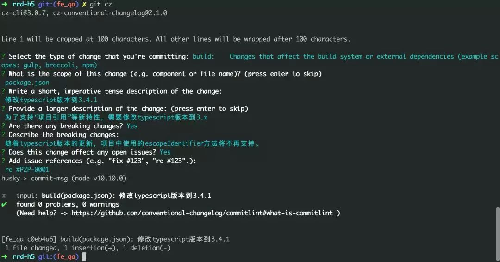
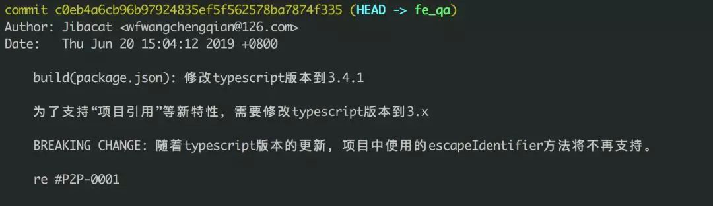

**来源**：

> [https://link.zhihu.com/?target=http%3A//juejin.im/post/5d0b3f8c6fb9a07ec07fc5d0](https://link.zhihu.com/?target=http%3A//juejin.im/post/5d0b3f8c6fb9a07ec07fc5d0)

git 是现在市面上最流行的版本控制工具，书写良好的 commit message 能大大提高代码维护的效率。但是在日常开发中由于缺少对 commit message 的约束，导致填写内容随意、质量参差不齐，可读性低亦难以维护。

## **用什么规范？**

现在市面上比较流行的方案是`约定式提交规范`（`Conventional Commits`），它受到了`Angular提交准则`的启发，并在很大程度上以其为依据。`约定式提交规范`是一种基于提交消息的轻量级约定。

它提供了一组用于创建清晰的提交历史的简单规则；这使得编写基于规范的自动化工具变得更容易。这个约定与`SemVer`相吻合，在提交信息中描述新特性、bug 修复和破坏性变更。它的 message 格式如下:

```
<类型>[可选的作用域]: <描述>

[可选的正文]

[可选的脚注]
```

## **Quick Start**

### 1. 全局安装 commitizen & cz-conventional-changelog

`commitizen`是一个撰写合格`commit message`的工具，用于代替`git commit` 指令，而`cz-conventional-changelog`适配器提供 conventional-changelog 标准（约定式提交标准）。基于不同需求，也可以使用不同适配器。

```shell
npm install -g commitizen cz-conventional-changelog
echo '{ "path": "cz-conventional-changelog" }' > ~/.czrc
```

安装完毕后，可直接使用`git cz`来取代`git commit`。
任何`git commit`指令的`option`都能用在 `git cz`指令上, 例如`git cz -a`

全局模式下，需要 `~/.czrc` 配置文件, 为`commitizen`指定`Adapter`。

### 2. 项目内安装 commitlint & husky

`commitlint`负责用于对`commit message`进行格式校验，`husky`负责提供更易用的`git hook`。
`Use npm`

```shell
npm i -D husky @commitlint/config-conventional @commitlint/cli
```

`Use yarn`

```shell
yarn add husky @commitlint/config-conventional @commitlint/cli -D
```

`commitlint`只能做格式规范，无法触及内容。对于内容质量的把控只能靠我们自己。

### 3. 添加相应配置

创建`commitlint.config.js`

```shell
# In the same path as package.json
echo 'module.exports = {extends: ["@commitlint/config-conventional"]};' > ./commitlint.config.js
```

引入`husky`

```shell
# yarn
yarn husky add .husky/commit-msg 'yarn commitlint --edit $1'
# npm
npx husky add .husky/commit-msg 'npx --no-install commitlint --edit "$1"'
```

### 4. 使用

执行`git cz`进入 interactive 模式，根据提示依次填写

```shell
1.Select the type of change that you're committing 选择改动类型 (<type>)
2.What is the scope of this change (e.g. component or file name)? 填写改动范围 (<scope>)
3.Write a short, imperative tense description of the change: 写一个精简的描述 (<subject>)
4.Provide a longer description of the change: (press enter to skip) 对于改动写一段长描述 (<body>)
5.Are there any breaking changes? (y/n) 是破坏性修改吗？默认n (<footer>)
6.Does this change affect any openreve issues? (y/n) 改动修复了哪个问题？默认n (<footer>)
```

生成的 commit message 格式如下：

```plain
<type>(<scope>): <subject>
<BLANK LINE>
<body>
<BLANK LINE>
<footer>
```

填写完毕后，`husky`会调用`commitlint`对 message 进行格式校验，默认规定`type`及`subject`为必填项。

## **Commit message 规范在 bdw 项目落地使用情况**

针对团队目前的情况，我们讨论后拟定了`commit message`每一部分的填写规则。

### 1. type

`type`为必填项，用于指定 commit 的类型，约定了`feat`、`fix`两个`主要type`，以及 docs、style、build、refactor、revert 五个`特殊type`，`其余type`暂不使用。

```plain
# 主要type
feat:     增加新功能
fix:      修复bug
# 特殊type
docs:     只改动了文档相关的内容
style:    不影响代码含义的改动，例如去掉空格、改变缩进、增删分号
build:    构造工具的或者外部依赖的改动，例如webpack，npm
refactor: 代码重构时使用
revert:   执行git revert打印的message
# 其它type
test:     添加测试或者修改现有测试
perf:     提高性能的改动
ci:       与CI（持续集成服务）有关的改动
chore:    不修改src或者test的其余修改，例如构建过程或辅助工具的变动
```

当一次改动包括`主要type`与`特殊type`时，统一采用`主要type`。

### 2. scope

`scope`也为必填项，用于描述改动的范围，格式为项目名/模块名，例如：
`node-pc/common` `rrd-h5/activity`，而`we-sdk`不需指定模块名。如果一次 commit 修改多个模块，建议拆分成多次 commit，以便更好追踪和维护。

### 3. subject

是 commit 目的的简短描述，不超过 50 个字符。

```git
以动词开头，使用第一人称现在时，比如change，而不是changed或changes
第一个字母小写
结尾不加句号（.）
```

### 4. body

`body`填写详细描述，主要描述`改动之前的情况`及`修改动机`，对于小的修改不作要求，但是重大需求、更新等必须添加 body 来作说明。

### 5. break changes

`break changes`指明是否产生了破坏性修改，涉及 break changes 的改动必须指明该项，类似版本升级、接口参数减少、接口删除、迁移等。

### 6. affect issues

`affect issues`指明是否影响了某个问题。例如我们使用 jira 时，我们在`commit message`中可以填写其影响的`JIRA_ID`，若要开启该功能需要先打通`jira`与`gitlab`。

参考文档：

> [https://docs.gitlab.com/ee/user/project/integrations/jira.html](https://docs.gitlab.com/ee/user/project/integrations/jira.html)

填写方式例如：

```
re #JIRA_ID
fix #JIRA_ID
```

## **示例**

完整的 commit message 示例



相应的 git log



## 扩展阅读

**1、**[**conventional commits**](https://www.conventionalcommits.org/en/v1.0.0/) `必读` 介绍约定式提交标准。

**2、[Angular 规范](https://github.com/angular/angular/blob/22b96b9/CONTRIBUTING.md#-commit-message-guidelines)** `必读` 介绍 Angular 标准每个部分该写什么、该怎么写。

**3、[@commitlint/config-conventional ](https://github.com/conventional-changelog/commitlint/tree/master/%40commitlint/config-conventional#type-enum)** `必读` 介绍 commitlint 的校验规则 config-conventional，以及一些常见 passes/fails 情况。
